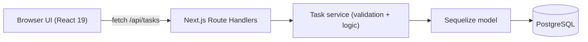

# Implementation Plan — Personal Task Manager

All implementation **must** follow this plan and [PRD.md](./PRD.md). If a change is needed, get approval first.

## Current layout

Git repo root: `Personal-Task-Manager/`

The Next.js app currently lives in `my-app/` (Create Next App default). Subfolders such as `src/` belong **inside the app**, not as a reason to keep an extra wrapper. Flattening `my-app/` to the repo root is optional and only happens if we explicitly decide to.

Until then, paths below use `my-app/`.

## Architecture

- **Framework:** Next.js 16 App Router + TypeScript + Tailwind v4
- **API:** Route Handlers
  - `my-app/src/app/api/tasks/route.ts` — GET list, POST create
  - `my-app/src/app/api/tasks/[id]/route.ts` — GET one, PATCH update/toggle, DELETE
- **Data:** Sequelize + `pg`
  - Connection singleton: `my-app/src/lib/db.ts` (guard Next.js hot-reload / multiple pools)
  - Model: `my-app/src/models/task.ts`
- **Validation:** `zod` in `my-app/src/lib/validation.ts`, shared by API and forms. Invalid input → 400 with field errors
- **UI:** `my-app/src/app/page.tsx` (server shell) + client components `TaskForm`, `TaskItem`, `TaskList` in `my-app/src/components/`

## Database

- `sequelize-cli` with `.sequelizerc`
- Config / migrations / seeders under `my-app/db/`
- Config reads `DATABASE_URL` (`tasks_dev` and `tasks_test`)
- One migration: create `tasks` table
- One seeder: a few sample tasks
- Container startup: `sequelize db:migrate` before `next start`

## Testing

- Vitest + React Testing Library + jsdom + `@vitejs/plugin-react`
- `vitest.config.ts` with two environments: `node` (API/service) and `jsdom` (components)
- Unit: zod schemas, task service
- Integration: route handlers against real `tasks_test` Postgres (migrate + truncate per test). Cover create/list/update/toggle/delete + 400/404
- Component: `TaskForm` (submit + validation error), `TaskItem` (toggle/delete)
- Scripts: `test`, `test:watch`, `test:coverage`

## Docker

- `output: 'standalone'` in `my-app/next.config.ts`
- Multi-stage `my-app/Dockerfile` + `.dockerignore`
- Repo-root `docker-compose.yml`: `db` (postgres:16, healthcheck, volume) and `app` (wait for healthy db, migrate, start)
- Ports 3000 / 5432
- `.env.example` for `DATABASE_URL` and `POSTGRES_*`

## Git / GitHub

- Trunk-based: `main` is the baseline; work on `feat/*` branches; merge via PR
- Conventional Commits
- GitHub Actions `.github/workflows/ci.yml` on PR/push: lint, typecheck, Vitest (Postgres service), `next build`
- PR template + `CONTRIBUTING.md`

## Implementation order

1. Dependencies (`sequelize`, `pg`, `zod`; Vitest/RTL/sequelize-cli as dev deps)
2. DB layer (singleton, Task model, migration, seeder)
3. Validation + task service
4. API route handlers
5. Frontend (`page.tsx`, `TaskForm`, `TaskList`, `TaskItem`)
6. Tests
7. Docker
8. GitHub Actions CI
9. README / CONTRIBUTING handoff docs

## Assumptions

- Node 20, PostgreSQL 16
- Single-user, no auth
- API tests call route handlers directly (no Supertest / running server)
- Commands that change the machine (`npm install`, migrate, Docker, git push) are run by the user unless they explicitly ask the agent to run them
