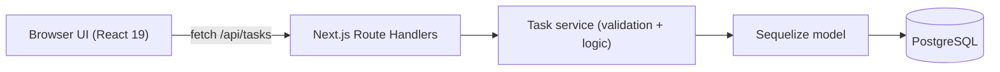

# Implementation Plan — Personal Task Manager

All implementation **must** follow this plan and [PRD.md](./PRD.md). If a change is needed, get approval first.

## Current layout

Git repo root: `Personal-Task-Manager/`

The Next.js app currently lives in `my-app/` (Create Next App default). Subfolders such as `src/` belong **inside the app**, not as a reason to keep an extra wrapper. Flattening `my-app/` to the repo root is optional and only happens if we explicitly decide to.

Until then, paths below use `my-app/`.

## Architecture

- **Framework:** Next.js 16 App Router + TypeScript + Tailwind v4
- **API:** Route Handlers
  - `my-app/src/app/api/tasks/route.ts` — GET list, POST create
  - `my-app/src/app/api/tasks/[id]/route.ts` — GET one, PATCH update/toggle, DELETE
- **Data:** Sequelize + `pg`
  - Connection singleton: `my-app/src/lib/db.ts` (guard Next.js hot-reload / multiple pools)
  - Model: `my-app/src/models/task.ts`
- **Validation:** `zod` in `my-app/src/lib/validation.ts`, shared by API and forms. Invalid input → 400 with field errors
- **UI:** `my-app/src/app/page.tsx` (server shell) + client components `TaskForm`, `TaskItem`, `TaskList` in `my-app/src/components/`

## Database

- `sequelize-cli` with `.sequelizerc`
- Config / migrations / seeders under `my-app/db/`
- Config reads `DATABASE_URL` (`tasks_dev` and `tasks_test`)
- One migration: create `tasks` table
- One seeder: a few sample tasks
- Container startup: `sequelize db:migrate` before `next start`

## Testing

- Vitest + React Testing Library + jsdom + `@vitejs/plugin-react`
- `vitest.config.ts` with two environments: `node` (API/service) and `jsdom` (components)
- Unit: zod schemas, task service
- Integration: route handlers against real `tasks_test` Postgres (migrate + truncate per test). Cover create/list/update/toggle/delete + 400/404
- Component: `TaskForm` (submit + validation error), `TaskItem` (toggle/delete)
- Scripts: `test`, `test:watch`, `test:coverage`

## Docker

- `output: 'standalone'` in `my-app/next.config.ts`
- Multi-stage `my-app/Dockerfile` + `.dockerignore`
- Repo-root `docker-compose.yml`: `db` (postgres:16, healthcheck, volume) and `app` (wait for healthy db, migrate, start)
- Ports 3000 / 5432
- `.env.example` for `DATABASE_URL` and `POSTGRES_*`

## Git / GitHub

`main` = stable (no direct commits). `dev` = integration.

**Daily loop** (features into `dev`):

1. `git checkout dev && git pull origin dev`
2. `git checkout -b <type>/<short-name>` — one topic only
3. Commit with Conventional Commits
4. Open a PR into **`dev`** (not `main`)
5. If review/CI fails, push fixes to **the same branch**
6. Merge, then go back to step 1

**Release loop:** when `dev` is in a good state, open a PR **`dev` → `main`**.

Do **not** reuse one catch-all branch for the whole app. Do **not** push feature work straight to `main`.

**PR description** (markdown, no Test plan checklist):

- Title: Conventional Commit (`feat: …`, `chore: …`, `docs: …`)
- Body:
  - `## Summary` — what landed, in bullets
  - `## Why` — why this change exists
  - `## Changes` — files / behavior in enough detail for a reviewer
  Do not add a Test plan section. Automated tests live in a later `test/setup` PR.

| Branch | Scope |
|---|---|
| `docs/prd-plan` | PRD + PLAN (+ agent rule links) — already done |
| `chore/deps` | `package.json` / lockfile only (sequelize, pg, zod, vitest, RTL, sequelize-cli) |
| `feat/db` | `.sequelizerc`, `db/config.js`, `src/lib/db.ts`, Task model, migration, seeder |
| `feat/api` | zod schemas, task service, `/api/tasks` route handlers |
| `feat/ui` | `page.tsx`, `TaskForm`, `TaskList`, `TaskItem` |
| `test/setup` | Vitest config + unit / API / component tests |
| `feat/docker` | Dockerfile, compose, `.env.example`, migrate-on-start |
| `ci` | `.github/workflows/ci.yml`, PR template |
| `docs/handoff` | README + `CONTRIBUTING.md` |

- GitHub Actions `.github/workflows/ci.yml` on PR/push: lint, typecheck, Vitest (Postgres service), `next build`
- PR template + `CONTRIBUTING.md`

## Implementation order

Each numbered item is its **own branch and PR into `dev`** (see table above). Do not start the next branch until the current PR is merged (or abandoned). When the app is ready to submit, PR `dev` → `main`.

1. `chore/deps` — dependencies
2. `feat/db` — DB layer (singleton, Task model, migration, seeder)
3. `feat/api` — validation + task service + route handlers
4. `feat/ui` — frontend
5. `test/setup` — tests
6. `feat/docker` — Docker
7. `ci` — GitHub Actions CI
8. `docs/handoff` — README / CONTRIBUTING

## Assumptions

- Node 20, PostgreSQL 16
- Single-user, no auth
- API tests call route handlers directly (no Supertest / running server)
- Commands that change the machine (`npm install`, migrate, Docker, git push) are run by the user unless they explicitly ask the agent to run them
